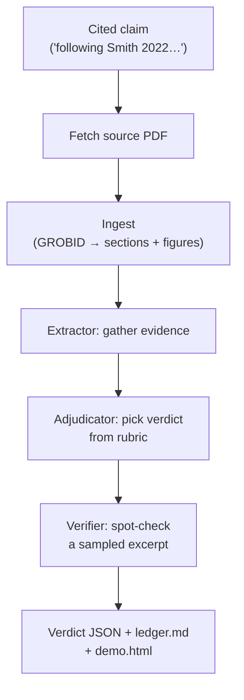

<p align="center">
  
</p>

<h1 align="center">paper-trail</h1>

<p align="center">
  Does the paper you cited actually say that? <code>paper-trail</code> reads each cited source in full, extracts evidence, and records a verdict per claim.
</p>

<p align="center">
  The bracket-number citation is a pre-digital convention — a reader sees <code>[7]</code> and takes the link from claim to source on faith. It doesn't have to work that way anymore.
</p>

<p align="center">
  <a href="https://philadamson93.github.io/paper-trail/demo.html">
    
  </a>
</p>

<p align="center">
  <sub>Click any claim in the sidebar to jump to its spot in the PDF. Repo copy: <a href="examples/paper-trail-adamson-2025/"><code>examples/paper-trail-adamson-2025/</code></a>.</sub>
</p>

---

Shipped as Claude Code slash commands. Each run produces a machine-readable verdict ledger (JSON) and a standalone HTML viewer; a polished web UI is in separate development by a collaborator.

## Why

Scientific papers routinely cite 50–100 references, and verifying every one by hand rarely happens — LLM-assisted writing makes plausibly-phrased misattributions easier to produce and harder to spot.

`paper-trail` serves three audiences:

- **Authors** — proofread your own citations before submission; establish the rigor of your grounding work in the record.
- **Reviewers** — skip the manual slog of opening every cited paper; triage from a ledger of flagged entries.
- **Readers and the public** — follow a transparent trail from each claim to its source and decide what to trust.

## How it works



Say a paper includes *"following the method in Smith et al. 2022, we pretrained for 100 epochs on 1.2M images"* — one citation, two factual sub-claims. `/paper-trail`:

1. **Resolves** `Smith et al. 2022` from the paper's bibliography.
2. **Fetches** the Smith 2022 PDF (arXiv / open-access, or prompts you for institutional access if paywalled).
3. **Ingests** the PDF into structured sections + figures (GROBID, with `pdftotext` / OCR fallbacks).
4. **Extracts evidence** for each sub-claim — the "100 epochs" procedure and the "1.2M images" dataset — with verbatim quotes and page numbers.
5. **Adjudicates** each sub-claim from a fixed rubric: `CONFIRMED`, `OVERSTATED` (Smith says 95 epochs), `UNSUPPORTED` (no epoch count in the paper), `MISATTRIBUTED` (Smith credits another paper for that procedure), `AMBIGUOUS` (close call that awaits human triage), and so on.
6. **Spot-checks** a sampled piece of evidence with a third independent subagent to catch fabricated quotes.
7. **Records** everything — verdict, sub-claim breakdown, evidence quotes, page numbers, suggested fix — in a per-claim JSON. A `ledger.md` and a self-contained `demo.html` viewer are rendered from those JSONs.

Repeat for every citation. At 50+ references per paper, this is why it usually doesn't get done by hand in review.

## Install

```bash
git clone https://github.com/philadamson93/paper-trail.git ~/src/paper-trail
cd ~/src/paper-trail
```

For system prerequisites (GROBID, poppler, optional MCPs), ask Claude:

```
claude "set up paper-trail prereqs on this machine"
```

Details: [docs/prerequisites.md](docs/prerequisites.md).

Two ways to run:

- **From the repo.** The orchestrator reads dispatch prompts, JSON schemas, and helper scripts from `.claude/` at cwd. `cd ~/src/paper-trail` and invoke `/paper-trail` there; reader-mode output lands in `./paper-trail-<pdf-stem>/`.
- **Vendor-copy into your project.** For author mode against your own manuscript:

  ```bash
  cp -r ~/src/paper-trail/.claude .
  cp -r ~/src/paper-trail/templates .
  ```

  Then invoke `/paper-trail --author` from the project root.

The older "symlink just the commands" install path does not work with v2 — the orchestrator needs `.claude/prompts/`, `.claude/specs/`, and `.claude/scripts/` at cwd.

## Run it

One entry point, two workflows.

### Reader mode — audit someone else's paper

```bash
/paper-trail                                  # fully interactive
/paper-trail <path-to-pdf>                    # audit that PDF
/paper-trail <path-to-pdf> --skip-paywalled   # don't block on paywalled refs
/paper-trail <path-to-pdf> --scope=single     # ground one claim you describe
/paper-trail <path-to-pdf> --triage           # resolve AMBIGUOUS entries
```

Writes a self-contained audit artifact to `./paper-trail-<pdf-stem>/`.

### Author mode — audit your own in-progress manuscript

```bash
/paper-trail --author                         # against current writing project
/paper-trail --author path/to/document.tex    # against a specific .tex
```

Writes to `claims_ledger.md` at the project root — that's both the audit config (YAML frontmatter: `pdf_dir`, `bib_files`, institutional access) and the rendered ledger. On first run, prompts you to bootstrap it via `/init-writing-tools` (one-time, detects your `.bib` and PDF layout).

> **On paywalled sources.** `paper-trail` can only auto-fetch open-access PDFs. Paywalled references are stubbed and marked `PENDING`; drop the PDF in by hand (institutional access, ILL, authors' websites) and re-run to ground them. Nothing bypasses paywalls.

## Cautions

- **LLMs can make mistakes.** Despite attestation and the verifier, the agent can misread tables, misclassify a claim, or get a verdict wrong. Every flagged entry (`UNSUPPORTED`, `CONTRADICTED`, `AMBIGUOUS`, `UNVERIFIED_ATTESTATION`, `CITED_OUT_OF_CONTEXT`, `INDIRECT_SOURCE`, `MISATTRIBUTED`) should be **manually verified** against the cited source before you act on it. Treat the ledger as a triage queue, not a verdict.
- **Editing assistance, not scholarly judgment.** A finding on someone else's published paper is a hypothesis surfaced by an LLM that read the cited source; it is not a ground-truth accounting of prior published work. Use findings as leads to investigate, not as conclusions to publish.

## Learn more

- **[Outputs & verdicts](docs/output.md)** — what files land on disk, full verdict rubric, remediation categories.
- **[Trust model](docs/trust-model.md)** — two-pass dispatch, attestation, verifier, substitution policy.
- **[Internals](docs/internals.md)** — orchestrator phases, component commands, schemas, scripts.
- **[Prerequisites](docs/prerequisites.md)** — what Claude installs for you.

## License

[PolyForm Noncommercial License 1.0.0](https://polyformproject.org/licenses/noncommercial/1.0.0) — see [LICENSE](LICENSE).

Free for personal work, academic research, non-profit projects, and internal research at any organization. Commercial use (selling the software, offering it as paid SaaS, incorporating it into a paid product) is not permitted under this license. Open an issue if you'd like a commercial license.

PolyForm NC is a *source-available* license, not OSI-approved "open source". All non-commercial-resale uses are permitted.
