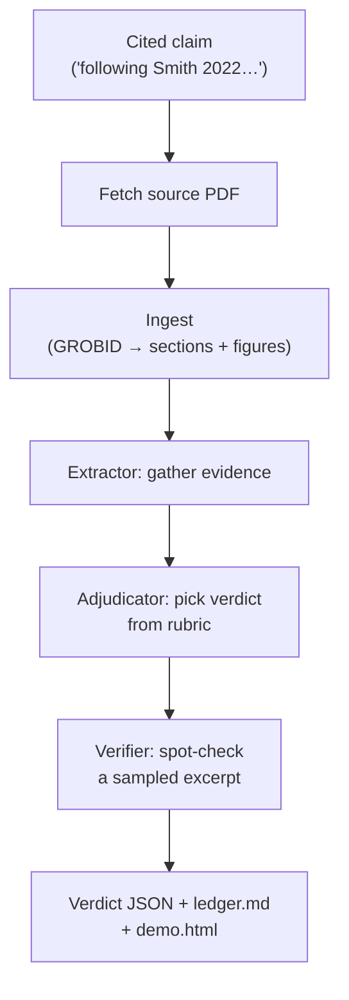

<p align="center">
  
</p>

# paper-trail

Does the paper you cited actually say that? `paper-trail` is LLM-powered citation auditing for scientific papers: it reads each cited source in full, extracts evidence, and records a verdict per claim.

Shipped as Claude Code slash commands. Each run produces a machine-readable verdict ledger (JSON) and a standalone HTML viewer; a polished web UI is in separate development by a collaborator.

## Why

Scientific papers routinely cite 50–100 references. Verifying that every claim actually matches its cited source is laborious, mistake-prone, and skipped in practice — and LLM-assisted writing makes plausibly-phrased misattributions easier to produce and harder to spot-check.

`paper-trail` automates the per-citation workflow: locate the claim in the source, extract the relevant passage with a page number, classify how the claim is supported (or not), and record it in an audit trail alongside the manuscript so an author or reviewer can see the receipts.

## How it works



Say a paper includes *"following the method in Smith et al. 2022, we pretrained for 100 epochs on 1.2M images"* — one citation, two factual sub-claims. `/paper-trail`:

1. **Resolves** `Smith et al. 2022` from the paper's bibliography.
2. **Fetches** the Smith 2022 PDF (arXiv / open-access, or prompts you for institutional access if paywalled).
3. **Ingests** the PDF into structured sections + figures (GROBID, with `pdftotext` / OCR fallbacks).
4. **Extracts evidence** for each sub-claim — the "100 epochs" procedure and the "1.2M images" dataset — with verbatim quotes and page numbers.
5. **Adjudicates** each sub-claim from a fixed rubric: `CONFIRMED`, `OVERSTATED` (Smith says 95 epochs), `UNSUPPORTED` (no epoch count in the paper), `MISATTRIBUTED` (Smith credits another paper for that procedure), `AMBIGUOUS` (close call that awaits human triage), and so on.
6. **Spot-checks** a sampled piece of evidence with a third independent subagent to catch fabricated quotes.
7. **Records** everything — verdict, sub-claim breakdown, evidence quotes, page numbers, suggested fix — in a per-claim JSON file. A `ledger.md` and a self-contained `demo.html` viewer are rendered from those JSONs.

Repeat for every citation. At 50+ references per paper, this is why it usually doesn't get done by hand in review.

## See a real run

[`examples/paper-trail-adamson-2025/`](examples/paper-trail-adamson-2025/) is a full audit of Adamson et al. 2025 (*Magnetic Resonance in Medicine*) — 56 references, 88 claims, 49 grounded (39 paywalled and stubbed), six critical findings including two `MISATTRIBUTED` miscitations. The bundle contains:

- **`demo.html`** — open it in a browser; no server. Citation markers in the paper body are colored by verdict severity; hover any marker for the full evidence popup.
- **`data/claims/<id>.json`** — 88 per-claim verdict files (the source of truth).
- **`input-paper.pdf`** — the audited paper itself.
- **`refs.bib`** / **`refs.verified.bib`** — parsed and CrossRef-enriched bibliographies.
- **`verdict_schema.md`** — the JSON schema every claim file conforms to.

## Install

```bash
git clone https://github.com/philadamson93/paper-trail.git ~/src/paper-trail
cd ~/src/paper-trail
```

Then either:

- **Run from the repo.** The orchestrator reads dispatch prompts, JSON schemas, and helper scripts from `.claude/` at cwd. The simplest path is to `cd ~/src/paper-trail` and invoke `/paper-trail` there; reader-mode output lands in `./paper-trail-<pdf-stem>/`.
- **Vendor-copy into your project.** For author mode against your own manuscript, copy the workflow files into your writing project:

  ```bash
  cp -r ~/src/paper-trail/.claude .
  cp -r ~/src/paper-trail/templates .
  ```

  Then invoke `/paper-trail --author` from the project root.

The older "symlink just the commands" install path does not work with v2 — the orchestrator needs `.claude/prompts/`, `.claude/specs/`, and `.claude/scripts/` present at cwd.

## Prerequisites

Commands adapt to whichever tools are available, but quality is proportional to what's installed.

- **GROBID (recommended).** Turns cited PDFs into clean per-section text + figures for Phase 2.5 ingest. One line to run locally:

  ```bash
  docker run --rm -d --name grobid -p 8070:8070 lfoppiano/grobid:0.8.2
  ```

  Without GROBID, the pipeline falls back to `pdftotext` (flat text, no per-section structure; figures still extracted). Serviceable for most claim types; DIRECT claims against numerical tables are weaker.

- **Claude Code MCPs (optional but useful).**
  - **`pdf-reader`** — local PDFs with page attribution. Browse [awesome-mcp-servers](https://github.com/modelcontextprotocol/servers) or [mcpservers.org](https://mcpservers.org/).
  - **`paper-search`** — arXiv / bioRxiv / medRxiv / PubMed downloads.
  - **`papersflow`** — purpose-built citation verification over 474M+ papers. Direct upgrade to `/verify-bib`:

    ```bash
    claude mcp add papersflow --transport streamable-http https://doxa.papersflow.ai/mcp
    ```

- **Fallbacks.** `pdftotext` (from poppler) + plain HTTP fetches to CrossRef / arXiv cover the no-MCP path.

## Run it

A single entry point for two workflows.

### Reader mode — audit someone else's paper

```bash
/paper-trail                                  # fully interactive
/paper-trail <path-to-pdf>                    # audit that PDF
/paper-trail <path-to-pdf> --skip-paywalled   # don't block on paywalled refs
/paper-trail <path-to-pdf> --scope=single     # ground one claim you describe
/paper-trail <path-to-pdf> --triage           # resolve AMBIGUOUS entries
```

Writes a self-contained audit artifact to `./paper-trail-<pdf-stem>/`.

### Author mode — audit your own in-progress manuscript

```bash
/paper-trail --author                         # against current writing project
/paper-trail --author path/to/document.tex    # against a specific .tex
```

Writes to `claims_ledger.md` at the project root — that's both the audit config (YAML frontmatter: `pdf_dir`, `bib_files`, institutional access) and the rendered ledger. On first run, prompts you to bootstrap it via `/init-writing-tools` (one-time, detects your `.bib` and PDF layout).

## What you get

Every run produces:

- **`ledger/claims/<id>.json`** — one verdict file per claim. This is the source of truth: claim text, sub-claim breakdown, verdicts, evidence quotes, attestation log, remediation. Schema: [`.claude/specs/verdict_schema.md`](.claude/specs/verdict_schema.md).
- **`ledger.md`** — human-readable view rendered from the JSONs. Hand-edits are overwritten on re-render; annotate the JSON's `nuance` or `history[]` fields instead.
- **`demo.html`** — PDF.js-based viewer with the input paper on the left and a filterable claim ledger on the right. Click a claim to jump to the spot in the PDF; click a citation marker in the PDF to highlight the matching claims. The PDF is inlined by default so the file opens in any browser from `file://` with no setup; pass `--external-pdf` to the renderer if you'd prefer a lightweight HTML that fetches the PDF as a sibling file.
- **`pdfs/<citekey>.pdf`** + **`pdfs/<citekey>/`** — fetched source PDFs and their GROBID ingest handles (per-section text, figures, meta).
- **`refs.bib`** / **`refs.verified.bib`** — PDF-parsed bibliography and its CrossRef-enriched counterpart.
- **`parse_report.md`** — parser diagnostics (reader mode only).
- **`trace/*.jsonl`** — per-subagent dispatch log, grep-able for observability.

### Verdict cheat sheet

Every sub-claim gets exactly one verdict. A claim's overall verdict rolls up from its sub-claims. The full rubric lives in [`.claude/specs/verdict_schema.md`](.claude/specs/verdict_schema.md).

| Verdict | Meaning |
|---|---|
| `CONFIRMED` | Evidence directly supports the sub-claim |
| `CONFIRMED_WITH_MINOR` | Supported with small caveats (overall-only) |
| `OVERSTATED_MILD` / `OVERSTATED` | True, but the manuscript's wording is stronger than the source's — *strength* drift |
| `OVERGENERAL` | True in the paper's narrow scope; manuscript generalizes beyond — *scope* drift |
| `PARTIALLY_SUPPORTED` | Some sub-claims hold; others don't |
| `CITED_OUT_OF_CONTEXT` | Passage exists but is used in a materially different context |
| `UNSUPPORTED` | No evidence found on careful read (≥3 phrasings, full section checklist) |
| `CONTRADICTED` | Evidence actively contradicts the claim — critical |
| `MISATTRIBUTED` | Claim is true but this isn't the source for it |
| `INDIRECT_SOURCE` | Paper has the fact but itself credits another primary — reference-hygiene issue |
| `AMBIGUOUS` | Agent read fully but couldn't confidently pick between candidate verdicts; awaits user triage |
| `PENDING` | Not yet checked (paywall / ingest error) — carries a `NEEDS_PDF` / `NEEDS_OCR` flag |

### Remediation categories

When a verdict isn't `CONFIRMED`, every entry carries a suggested fix: `REWORD` (soften strength), `RESCOPE` (narrow the claim), `RECITE` (wrong source; suggest a different one), `CITE_PRIMARY` (replace with the primary source the cited paper itself credits), `SPLIT`, `ADD_EVIDENCE`, `REMOVE`, or `ACCEPT_AS_FRAMING`.

## Why the verdicts are trustworthy

Every judgment step (reading, evidence extraction, verdict, remediation) is performed by an LLM. The trust model is process discipline *around* the LLM:

- **Two-pass dispatch.** An extractor reads the ingested source and records evidence; a separate adjudicator reads only the evidence JSON + the rubric (no paper) and picks a verdict. This keeps each subagent's context narrow and the verdict deterministic given the evidence.
- **Full attestation.** Before any `UNSUPPORTED` or `CONTRADICTED` verdict, the extractor must record a section-by-section read checklist, ≥3 distinct phrasings searched, and the closest adjacent passage. No abstract-only shortcuts.
- **Independent verifier.** After adjudication, a third subagent sees only the claim + one sampled evidence entry + the rubric and confirms the excerpt exists in the source as recorded. `FAIL` bounces the claim back through extractor + adjudicator; `PARTIAL` adds an `UNVERIFIED_ATTESTATION` flag.
- **Structured exit JSON.** Every subagent's output is validated against a schema; malformed output retries once then escalates.
- **Configurable fetch substitution.** When a DOI is paywalled but a related preprint exists, `--fetch-substitute=<never|ask|always>` governs whether to accept the substitute; every substitution is logged in `parse_report.md` and every downstream claim's attestation.

## Cautions

- **LLMs can make mistakes.** Despite attestation and the verifier, the agent can misread tables, misclassify a claim, or get a verdict wrong. Every flagged entry (`UNSUPPORTED`, `CONTRADICTED`, `AMBIGUOUS`, `UNVERIFIED_ATTESTATION`, `CITED_OUT_OF_CONTEXT`, `INDIRECT_SOURCE`, `MISATTRIBUTED`) should be **manually verified** against the cited source before you act on it. Treat the ledger as a triage queue, not a verdict.
- **Editing assistance, not scholarly judgment.** A finding on someone else's published paper is a hypothesis surfaced by an LLM that read the cited source; it is not a ground-truth accounting of prior published work. Use findings as leads to investigate, not as conclusions to publish.

## Under the hood

`/paper-trail` is the orchestrator. For targeted use, four component commands are individually invocable:

| Command | Purpose |
|---|---|
| [`/init-writing-tools`](.claude/commands/init-writing-tools.md) | One-time author-mode bootstrap: detect `.bib` + PDF layout, write `claims_ledger.md` config. |
| [`/verify-bib`](.claude/commands/verify-bib.md) | BibTeX metadata audit against CrossRef / arXiv / PapersFlow; `--fix` writes corrections. |
| [`/fetch-paper`](.claude/commands/fetch-paper.md) | Download open-access PDFs or surface retrieval prompts for paywalled ones. |
| [`/ground-claim`](.claude/commands/ground-claim.md) | Two-pass grounding of a single claim or a whole `.tex` file. Also provides `--triage`. |

None of these edits the manuscript. Every issue is surfaced as a proposal for the user to accept.

### Implementation details

The authoritative specs live in the repo itself — the slash-command files and schemas *are* the spec, not a wrapper around hidden code:

- **Orchestrator phases (0 → 4)** and invocation flags — [`.claude/commands/paper-trail.md`](.claude/commands/paper-trail.md).
- **Verdict JSON schema + rollup rules + validation** — [`.claude/specs/verdict_schema.md`](.claude/specs/verdict_schema.md).
- **Ingest handle layout + GROBID pipeline** — [`.claude/specs/ingest.md`](.claude/specs/ingest.md) and [`.claude/scripts/ingest_pdf.py`](.claude/scripts/ingest_pdf.py).
- **Dispatch prompts** (extractor / adjudicator / verifier) — [`.claude/prompts/`](.claude/prompts/).
- **HTML demo renderer** — [`.claude/scripts/render_html_demo.py`](.claude/scripts/render_html_demo.py).

## License

[PolyForm Noncommercial License 1.0.0](https://polyformproject.org/licenses/noncommercial/1.0.0) — see [LICENSE](LICENSE).

Free for personal work, academic research, non-profit projects, and internal research at any organization. Commercial use (selling the software, offering it as paid SaaS, incorporating it into a paid product) is not permitted under this license. Open an issue if you'd like a commercial license.

PolyForm NC is a *source-available* license, not OSI-approved "open source". All non-commercial-resale uses are permitted.
