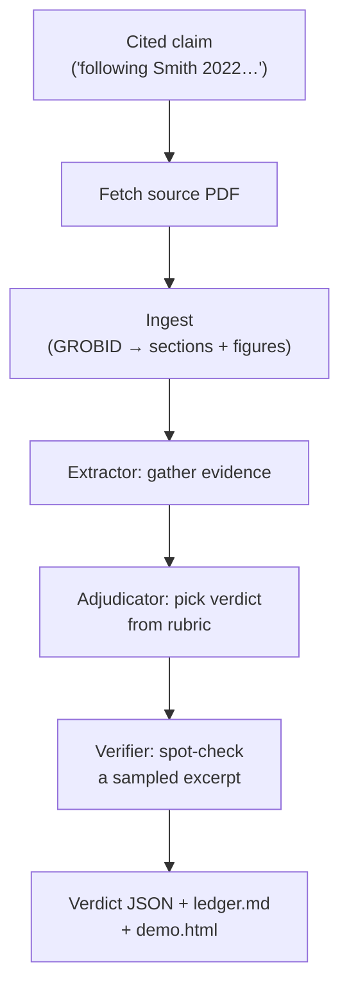

<p align="center">
  
</p>

<h1 align="center">paper-trail</h1>

<p align="center">
  Academic papers follow an outdated citation convention: <code>[7]</code> sends readers to an entire paper without saying where the claim is supported or whether the author represented it faithfully. <code>paper-trail</code>, a Claude Code–native workflow, checks that every cited source actually backs the corresponding claim.
</p>

<p align="center">
  I ran retrospective audits on two of my own published papers with <code>paper-trail</code>:
</p>

<p align="center">
  <a href="https://philadamson93.github.io/paper-trail/Adamson-MRM-DFDs-2025.html">
    
  </a>
  &nbsp;
  <a href="https://philadamson93.github.io/paper-trail/Adamson-MRM-DMI-2024.html">
    
  </a>
</p>

---

## Why paper-trail

Scientific papers routinely cite 50–100 references, each backing a claim in the text. Even careful authors can make mistakes, from subtle overgeneralizations to outright unsupported claims. Reviewers rarely verify every citation by hand, and mistakes that slip through peer review may propagate through the literature.

`paper-trail` brings citation provenance to authors, reviewers, and the public alike:

- **Authors:** proofread your own citations before submission and properly scope claims.
- **Reviewers:** skip the manual slog of opening every cited paper; triage from a ledger of flagged entries.
- **Readers and the public:** establishes trust by following a transparent trail from each claim to its source.

## Getting Started

Clone this repo and launch Claude Code in it:

```bash
git clone https://github.com/philadamson93/paper-trail.git ~/src/paper-trail
cd ~/src/paper-trail
```

Then, inside Claude Code:

1. **One-time install:** run `/paper-trail-init` to bootstrap system prerequisites (GROBID, poppler, optional MCPs). Details: [docs/prerequisites.md](docs/prerequisites.md).
2. **Audit a paper:** run `/paper-trail` and answer a few setup questions.

One entry point, two modes.

### Reader mode: audit someone else's paper

```bash
/paper-trail                                  # fully interactive
/paper-trail <path-to-pdf>                    # audit that PDF
/paper-trail <path-to-pdf> --skip-paywalled   # don't block on paywalled refs
/paper-trail <path-to-pdf> --scope=single     # ground one claim you describe
/paper-trail <path-to-pdf> --triage           # resolve AMBIGUOUS entries
```

Writes a self-contained audit artifact to `./paper-trail-<pdf-stem>/`.

### Author mode: audit your own in-progress manuscript

Nothing to install into your writing project — paper-trail runs from its own clone and takes your manuscript's **absolute path** as an argument. Any of these invocation patterns works:

```bash
# 1. From inside paper-trail's directory
cd ~/src/paper-trail && claude
/paper-trail --author /abs/path/to/writing-repo/main.tex

# 2. From your writing repo, with paper-trail added to the session
cd /path/to/writing-repo && claude --add-dir ~/src/paper-trail
/paper-trail --author $(pwd)/main.tex
```

```bash
# 3. Optional convenience: make the command discoverable from any directory
#    (Claude Code requires the .claude/commands/ path for slash-command discovery)
ln -s ~/src/paper-trail/.claude/commands/paper-trail.md ~/.claude/commands/paper-trail.md
```

The manuscript path must be absolute so paper-trail can locate it regardless of where Claude Code was launched. Outputs land alongside the manuscript by default — `<manuscript-dir>/claims_ledger.md` (audit config + rendered ledger), `<manuscript-dir>/ledger/`, and `<manuscript-dir>/demo.html` — overridable with `--output-dir <path>`. On first run, paper-trail prompts you to bootstrap the ledger via `/init-writing-tools` (one-time, detects your `.bib` and PDF layout).

Copying paper-trail into a writing repo (vendoring) is intentionally not supported: a manual `cp -R` snapshot will work, but updates won't flow to it.

## How it works


```mermaid
flowchart TD
    A["Cited claim<br/>('following Smith 2022…')"] --> B["Fetch source PDF"]
    B --> C["Ingest<br/>(GROBID → sections + figures)"]
    C --> D["Extractor: gather evidence"]
    D --> E["Adjudicator: pick verdict<br/>from rubric"]
    E --> F["Verifier: spot-check<br/>a sampled excerpt"]
    F --> G["Verdict JSON + ledger.md<br/>+ demo.html"]
    classDef default font-size:14px;
```

Say a paper includes *"following the method in Smith et al. 2022, we pretrained for 100 epochs on 1.2M images"*: one citation, two factual sub-claims. `/paper-trail`:

1. **Resolves** `Smith et al. 2022` from the paper's bibliography.
2. **Fetches** the Smith 2022 PDF (arXiv / open-access, or prompts you for institutional access if paywalled).
3. **Ingests** the PDF into structured sections + figures (GROBID, with `pdftotext` / OCR fallbacks).
4. **Extracts evidence** for each sub-claim (the "100 epochs" procedure and the "1.2M images" dataset), with verbatim quotes and page numbers.
5. **Adjudicates** each sub-claim from a fixed rubric: `CONFIRMED`, `OVERSTATED` (Smith says 95 epochs), `UNSUPPORTED` (no epoch count in the paper), `MISATTRIBUTED` (Smith credits another paper for that procedure), `AMBIGUOUS` (close call that awaits human triage), and so on.
6. **Spot-checks** a sampled piece of evidence with a third independent subagent to catch fabricated quotes.
7. **Records** everything (verdict, sub-claim breakdown, evidence quotes, page numbers, suggested fix) in a per-claim JSON. A `ledger.md` and a self-contained `demo.html` viewer are rendered from those JSONs.

Repeat for every citation. At 50+ references per paper, this is why it usually doesn't get done by hand in review.

## Cautions

- **LLMs can make mistakes.** Despite attestation and the verifier, the agent can misread tables, misclassify a claim, or get a verdict wrong. Every flagged entry (`UNSUPPORTED`, `CONTRADICTED`, `AMBIGUOUS`, `UNVERIFIED_ATTESTATION`, `CITED_OUT_OF_CONTEXT`, `INDIRECT_SOURCE`, `MISATTRIBUTED`) should be **manually verified** against the cited source before you act on it. Treat the ledger as a triage queue, not a verdict.
- **Editing assistance, not scholarly judgment.** A finding on someone else's published paper is a hypothesis surfaced by an LLM that read the cited source; it is not a ground-truth accounting of prior published work. Use findings as leads to investigate, not as conclusions to publish.
- **Paywalled sources can't be auto-fetched.** `paper-trail` only grabs open-access PDFs. Paywalled references are stubbed and marked `PENDING`; drop PDFs in by hand by manually downloading with institutional access and re-run to ground them.

## Learn more

- **[Outputs & verdicts](docs/output.md):** what files land on disk, full verdict rubric, remediation categories.
- **[Trust model](docs/trust-model.md):** two-pass dispatch, attestation, verifier, substitution policy.
- **[Internals](docs/internals.md):** orchestrator phases, component commands, schemas, scripts.
- **[Prerequisites](docs/prerequisites.md):** what Claude installs for you.

## License

[PolyForm Noncommercial License 1.0.0](https://polyformproject.org/licenses/noncommercial/1.0.0); see [LICENSE](LICENSE).

Free for personal work, academic research, non-profit projects, and internal research at any organization. Commercial use (selling the software, offering it as paid SaaS, incorporating it into a paid product) is not permitted under this license. Open an issue if you'd like a commercial license.

PolyForm NC is a *source-available* license, not OSI-approved "open source". All non-commercial-resale uses are permitted.
